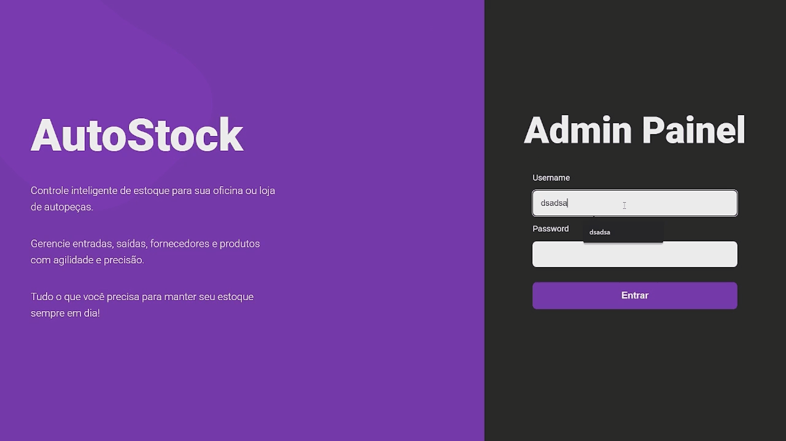

# AutoStock - Sistema de Controle de Estoque 🚗

> Status do Projeto: Em andamento..

Um sistema full-stack de controle de estoque desenvolvido como projeto para a matéria de "Projeto e Modelagem de Sistemas de Software" na Uninove. A aplicação simula um sistema para oficinas ou lojas de autopeças, com uma API RESTful em C# (.NET) e um front-end interativo construído com HTML, CSS e JavaScript puro.

---

### 📷 Demonstração



---

### 📋 Índice

* [Sobre o Projeto](#-sobre-o-projeto)
* [Funcionalidades](#-funcionalidades)
* [Tecnologias Utilizadas](#-tecnologias-utilizadas)
* [Como Executar o Projeto](#-como-executar-o-projeto)
* [Endpoints da API](#-endpoints-da-api)
* [Autor](#-autor)

---

### 📖 Sobre o Projeto

O **AutoStock** foi criado para aplicar os conceitos de desenvolvimento full-stack, desde a modelagem do banco de dados e criação de uma API robusta com C# e Entity Framework, até a construção de uma interface de usuário dinâmica e responsiva com JavaScript puro. O sistema permite o gerenciamento de produtos e fornecedores, além de visualizar um dashboard com estatísticas em tempo real, simulando um ambiente real de controle de estoque.

---

### ✨ Funcionalidades

- **✅ Autenticação:** Tela de login para acesso ao sistema.
- **✅ Dashboard Dinâmico:** Visualização em tempo real de KPIs importantes:
  - Total de produtos cadastrados.
  - Total de fornecedores.
  - Total de itens em estoque.
  - Valor total do estoque.
  - Alertas de produtos com estoque baixo.
  - Lista de produtos mais vendidos (Top 5).
- **✅ Gerenciamento de Produtos (CRUD):**
  - Listagem completa de todos os produtos.
  - Criação de novos produtos.
  - Edição de produtos existentes.
  - Exclusão de produtos.
- **✅ Gerenciamento de Fornecedores (CRUD):**
  - Funcionalidades completas para gerenciar fornecedores.

---

### 🛠️ Tecnologias Utilizadas

Este projeto foi construído com as seguintes tecnologias:

**Back-end:**
* **C# 12 e .NET 8:** Plataforma de desenvolvimento.
* **ASP.NET Core Web API:** Framework para criação da API RESTful.
* **Entity Framework Core:** ORM para comunicação com o banco de dados.
* **MySQL:** Banco de dados relacional (utilizando o provider Pomelo).
* **Swagger/OpenAPI:** Para documentação e teste dos endpoints da API.

**Front-end:**
* **HTML5:** Estruturação semântica das páginas.
* **CSS3:** Estilização moderna, utilizando Flexbox e Grid Layout.
* **JavaScript (ES6+):** Manipulação do DOM e interatividade.
* **Fetch API:** Para realizar a comunicação assíncrona com o back-end.
* **Font Awesome:** Biblioteca de ícones.

**Ambiente e Ferramentas:**
* **Visual Studio / JetBrains Rider:** IDE de desenvolvimento.
* **Git & GitHub:** Para versionamento de código.
* **Postman:** Para testes de API durante o desenvolvimento.

---

### 🚀 Como Executar o Projeto

Siga os passos abaixo para rodar a aplicação localmente.

**Pré-requisitos:**
* [.NET 8 SDK](https://dotnet.microsoft.com/pt-br/download/dotnet/8.0)
* Um servidor MySQL (como o MySQL Workbench ou XAMPP/WAMP).
* Um editor de código (como o VS Code) e um navegador web.

**1. Clonar o Repositório:**
```bash
git clone [https://github.com/matheus-artioli/StockControll.git](https://github.com/matheus-artioli/StockControll.git)
```

**2. Configurar e Rodar o Back-end (API):**
```bash
# Navegue até a pasta da API
cd StockControll/StockControlAPI

# Restaure as dependências do projeto
dotnet restore

# Abra o arquivo `appsettings.json` e ajuste a "DefaultConnection"
# com os dados do seu banco de dados MySQL local (usuário, senha, etc.).

# Aplique as migrations para criar as tabelas no banco de dados
dotnet ef database update

# Execute a API
dotnet run
```
A API estará rodando, geralmente em uma URL como `http://localhost:5049` ou `https://localhost:7123`.

**3. Abrir o Front-end:**
* Não há um passo de "build" para o front-end.
* Simplesmente abra os arquivos `index.html` (para o login) e `dashboard.html` diretamente no seu navegador.
* **Dica:** Para uma melhor experiência, use a extensão "Live Server" no VS Code.

---

### Endpoints da API

A API conta com os seguintes endpoints principais:

* `POST /api/auth/login` - Autentica um usuário.
* `GET /api/dashboard/stats` - Retorna as estatísticas para os cards do dashboard.
* `GET /api/dashboard/alerta-estoque` - Retorna produtos com estoque baixo.
* `GET /api/dashboard/top-vendas` - Retorna os 5 produtos mais vendidos.
* `GET, POST, PUT, DELETE /api/produtos` - CRUD completo para produtos.
* `GET, POST, PUT, DELETE /api/fornecedores` - CRUD completo para fornecedores.

---

### 👨‍💻 Autor

**Matheus Souza Artioli Antonio**

* [LinkedIn](https://www.linkedin.com/in/matheusartioli/)
* E-mail: matheus.artioli@outlook.com

---
